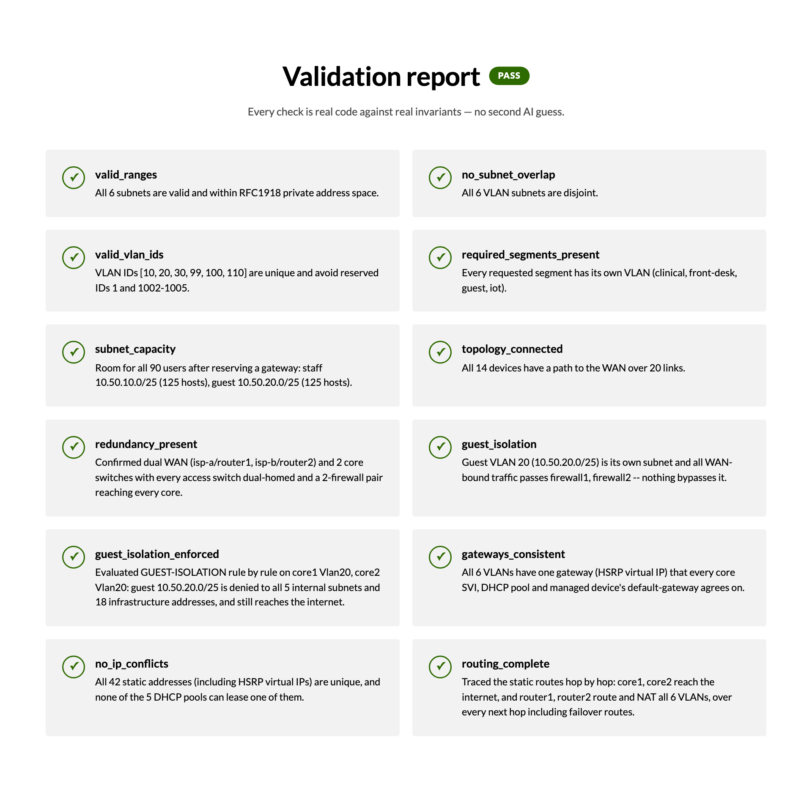

# AI Network Architect Copilot

**Describe a network in plain English. AI designs it; deterministic code proves it works.**

Built for LovHack Season 3 (Sept 26 – Oct 4, 2026) by Samir Singh and Nyles Groff.



Ask a chatbot to design a network and you get something that *looks* right,
with no way to know if it is. This project splits the job: an AI turns your
description into structured requirements, and plain code does everything
that has to be correct, then checks its own work.

## What it does

Type something like *"24/7 vet hospital, 90 staff, separate networks for
clinical and front desk, isolated guest Wi-Fi, no single point of failure"*
and get:

- **What we understood**: the extracted requirements plus every assumption
  the AI made ("90 users = 58 full-time + 22 part-time + 10 visiting"), so a
  human can check them instead of trusting them.
- **A design**: non-overlapping VLANs and subnets sized for every user, and
  a topology scaled to the headcount, with redundant ISPs, routers,
  firewalls and core switches when asked for.
- **A validation report**: 12 checks, all plain code. 8 check the design
  (address ranges, overlaps, capacity, connectivity, redundancy, guest
  isolation) and 4 audit the generated configs themselves (guest ACL
  applied, gateways agree, no duplicate IPs, every route resolves).
- **Break it**: 12 one-click sabotages, each of which turns exactly one check
  red on a typical design, to show the validator catching real mistakes.
- **A failure simulator**: knock out any devices and it walks traffic hop by
  hop through the generated configs (ACLs, routes, HSRP, IP SLA tracking,
  NAT, return path) to show what still works.
- **Cisco IOS-style configs** for every device (one at a time or as a zip),
  a budgetary **bill of materials**, and a one-page **PDF of the diagram**.
- **Refine and ask**: change the design in plain English and see exactly
  what changed, or ask a question and get an answer that cites the design's
  own devices and config lines.

## How it works

```
plain English ──► Claude ──► NetworkSpec ──► generator ──► NetworkPlan
                 (the only                                    │
                  AI step)          validator + config audit ◄┤
                                    config generator ◄────────┤
                                    failure simulator ◄───────┘
```

The AI is used for exactly three language tasks: extracting requirements,
applying a plain-English change, and answering questions about a finished
design. Every AI response is validated against the schema in
`shared/schema.py`. Everything after that is deterministic Python: subnet
math, graph search, a config parser and a packet-walking simulator.

## Run it

Needs **Python 3.10 or newer** (check with `python3 --version`). The
`python3` built into macOS is 3.9, which installs fine but crashes on
startup; get a newer one from [python.org](https://www.python.org/downloads/)
or with `brew install python`.

```bash
python3 -m venv venv
source venv/bin/activate        # Windows: venv\Scripts\activate
pip install -r requirements.txt
cp .env.example .env            # put your Anthropic API key in .env
uvicorn pipeline.api.main:app --reload
```

Then open http://127.0.0.1:8000/.

**No API key?** The sample design buttons under the input box run the full
engine with no AI call: validation, break-it, the simulator and downloads
all work. Only typing your own description, refine and ask need a key.

A guided tour of the demo is in [`docs/demo_script.md`](docs/demo_script.md).

## Tests

```bash
python -m pytest engine/ pipeline/
```

400+ tests, covering the generator, validator, config audit, simulator,
sabotages, API routes and the AI layer's error handling. The one test that
calls the real AI skips itself when no API key is set.

## Project layout

| Path | Owner | Contains |
|---|---|---|
| `pipeline/` | Samir | AI layer (`llm_layer.py`) and the FastAPI app (`api/`) |
| `dashboard/` | Samir | The web UI: plain HTML, CSS and JS with no build step, served by FastAPI |
| `engine/` | Nyles | Generator, validator, config generator and audit, simulator, sabotages, bill of materials |
| `shared/schema.py` | Both | The Pydantic models that are the contract between `pipeline/` and `engine/` |
| `docs/` | Both | The schema in plain language, the demo script and the Devpost writeup |

## Limitations

- The configs are Cisco IOS-*style* and illustrative: they're checked by our
  config audit and simulator but haven't been booted on real hardware or in
  an emulator yet.
- Bill-of-materials prices are budgetary estimates, not quotes.
- It designs single-site networks from scratch; it doesn't import an
  existing network.
